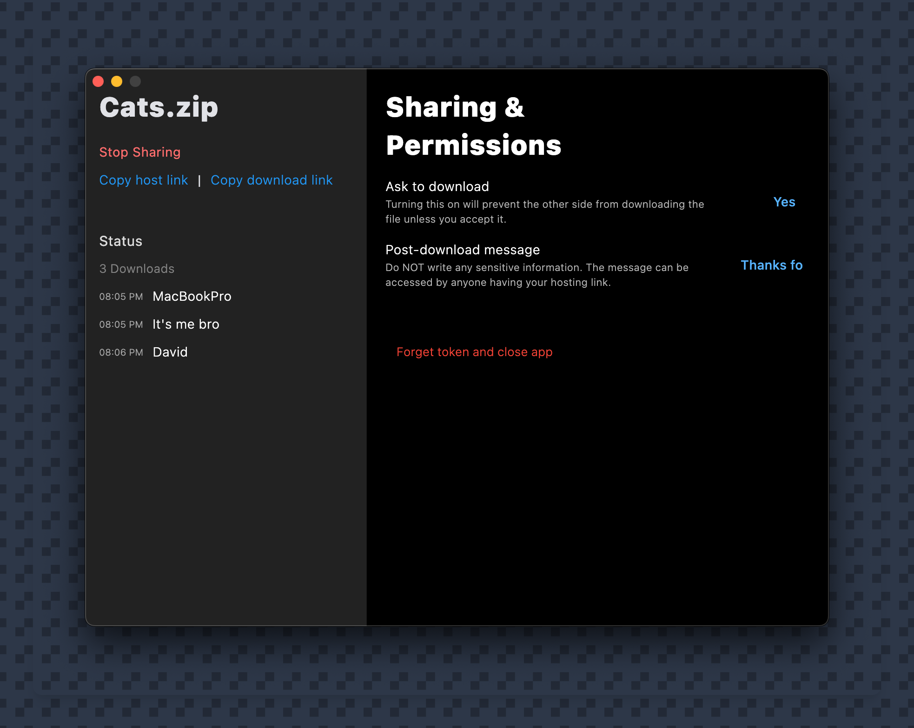

<div align="center">
    
</div>

<h1 align="center">The open-source limit-free file-sharing tool</h1>

Host and share your local file globally, control the sharing process, and there are no limits to the number of sharing times or file size! There are no third-party services involved—just you and your file (XoX#).

<div align="center">
    
</div>

- ✋ **No third-party services** - Because it’s not using any third-party services, it’s 100% free of cost and limits.
- 🔒 **You in control** - You control the sharing permissions. You can prevent and deny any request for accessing your file in real time. Or even just allow everyone to download it.
- 😌 **Easy-to-use** - The UI is super easy, and the tools are intuitive.
- ⚡ **Super fast** - It feels fast, and the actual experience is faster.

## Why 🙂??
Okay, I don’t have to play SubwaySurfers in the background while explaining this right? XD

You have a file on your computer that you want to share with a bunch of people. But maybe this file has content that goes against your usual file-sharing third-party service rules? Or maybe you just don’t want to put such a file in a service’s cloud? Maybe this file exceeds the free size limit, and the service wants you to pay to share now? IDC!

It’s simple—FileMeQuietly will allow you to share your file directly with the people you want. No censorship, no party in the middle, and no size limit.

## Usage
You can either clone it and run it or download the latest compiled version of the app compatible with your system.

### Clone
To clone this project, run this in your terminal:
```zsh
git clone https://github.com/SKbarbon/filemequietly.git
```

Then install the requirements in the requirements.txt file. Make sure to create a new virtual environment (venv) before that.
Run `app.py`.

### Download

Go to the [releases](https://github.com/SKbarbon/filemequietly/releases) Page to download the latest built version of the app.

## Bruh, how the F does that work? XD

Well, to achieve this “free-of-cost and no third-party involved in the middle” experience, I followed this approach:

Your file is on your computer. The tool will start a local host to host the file. But wait, how will people on another network access this host? We need some way to mirror a global URL to your localhost, right? So I used Ngrok APIs for this, and as you know, it’s totally free.

I am just a boy with an idea 👉👈🎀.